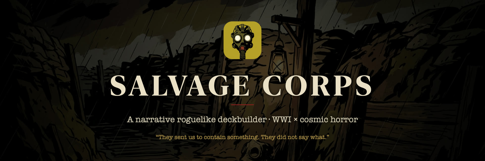
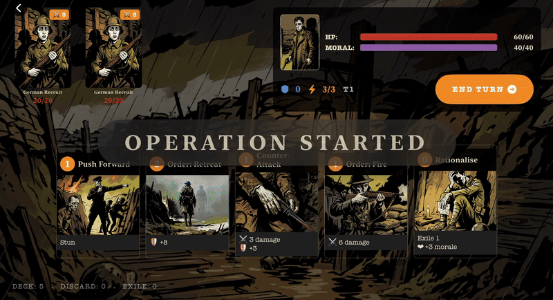
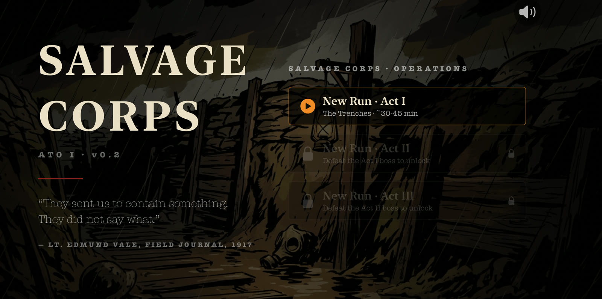
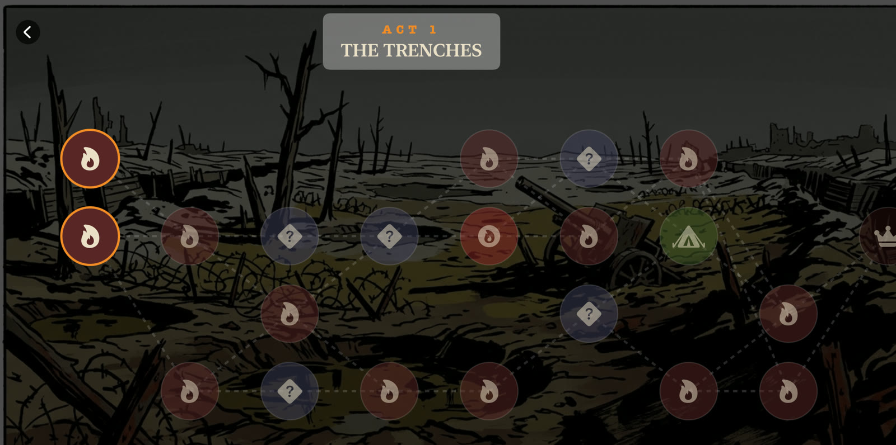
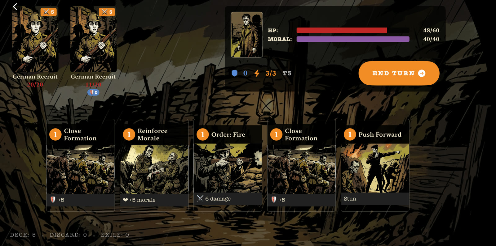
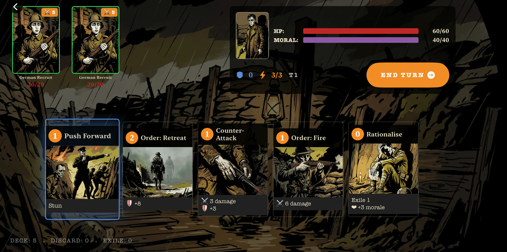
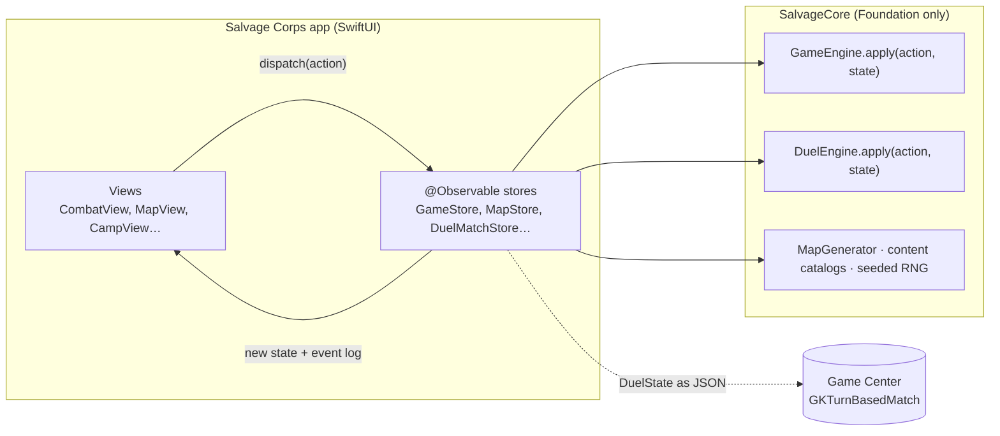

<p align="center">
  
</p>

<p align="center">
  <b>A narrative roguelike deckbuilder where First World War trench warfare meets cosmic horror.</b><br>
  Built solo in Swift and SwiftUI for iPhone, iPad and Mac.
</p>

<p align="center">
  <a href="https://itsjuniordias.itch.io/salvage-corps"><b>▶ Play on itch.io (macOS)</b></a> ·
  <a href="docs/images/gameplay.gif">Watch gameplay</a> ·
  <a href="#architecture">Architecture</a> ·
  <a href="#building-from-source">Build from source</a>
</p>

<p align="center">
  
</p>

## About

> *"They sent us to contain something. They did not say what."*
> Lt. Edmund Vale, Field Journal, 1917

You lead Lt. Edmund Vale's unit through three acts of trench warfare that slowly turns into something stranger. Like Slay the Spire, it has turn-based card combat on branching maps, but here you have two things to protect: your **HP** and your **Morale**. The enemies get into your head, and later into your deck. Cards you never chose start showing up in Act 3. The choice you make at the end of each act carries over between runs and decides which of five endings you reach.

The core rules (combat, duels, map generation, content catalogs and ending calculation) live in **SalvageCore**, a separate Swift package with no dependencies. At its center is a pure reducer, `GameEngine.apply(action, state)`, with a matching `DuelEngine` for PvP. The package has 112 unit tests.

## Features

- **Three acts, each its own run.** The Trenches, The Descent and The Revelation. Every act starts you with a fresh deck, and beating its boss unlocks the next act.
- **Branching maps.** Fixed story nodes (an opening fight, key events, an elite in Acts I–II, a pre-boss camp and the boss) sit among combats, elites, events and camps placed by a procedural generator.
- **Two ways to lose.** You start with 60 HP and 40 Morale, and the run ends if either reaches zero. Some enemies attack your Morale instead of your HP. You get 3 energy per turn and draw up to a 5-card hand.
- **15 obtainable cards.** A 10-card starter deck (8 distinct cards), 4 cards earned through events, and 3 "ghost" cards that force their way into your deck in Act 3.
- **24 scars.** Each of the 12 non-ghost cards has two upgrade paths: A usually adds power and B usually adds utility. You earn scars by reflecting at camp or as a chance reward after winning a fight.
- **11 enemy types, including 3 multi-phase bosses.** Hauptmann Krüger has 3 phases, the Barbed Apostle 2 and the General's Ghost 4. From Act 2 on, regular enemies hide their intents unless you find a way to listen. (Two Act 3 enemies still reuse Act 2 art and names.)
- **Fear and Corruption.** Fear weakens enemy attacks. From Act 2 on, Corruption drains Morale at the start of every turn. Corrupted cards add to it and steadier cards remove it.
- **23 events with 69 choices.** At each camp you can rest, reflect and talk, once each. Two of four squadmates are there to talk to, and in Act 3 a fifth, special NPC joins them. Conversations come from 23 dialogue scenes.
- **5 endings, one of them secret.** A terminal choice follows every boss. Those choices persist across runs and decide the ending.
- **Duels (iOS only).** Asynchronous 1v1 matches over Game Center turn-based play, with a 15-card deck builder, Elo rating and 6 rank tiers, a leaderboard, 14 achievements, push notifications when it's your turn, and a history of your last 100 matches.

## Screenshots

<table>
  <tr>
    <td></td>
    <td></td>
  </tr>
  <tr>
    <td></td>
    <td></td>
  </tr>
</table>

## Platforms & availability

| | iPhone & iPad | Mac |
|---|---|---|
| Get it | Build from source | [itch.io](https://itsjuniordias.itch.io/salvage-corps), $4.99 |
| Technology | SwiftUI, iOS 18.6+ | Mac Catalyst, macOS 15.6+ |
| Campaign (Acts I–III) | Yes | Yes |
| Duels (PvP) | Yes, with Game Center configured | Not included |

- **Designed for iPhone first.** The game is landscape only and laid out on an 852×393 pt canvas.
- **Mac.** A `UIScale` factor scales the whole UI with the window, from 1× up to 2.6×. The minimum window size is 960×600, and combat switches to a layout built for Mac. Keyboard controls: **1–9** play a card, **Space** ends the turn, **Esc** cancels.
- **Duels need App Store provisioning.** They depend on Game Center turn-based matches and push notifications, which need App Store provisioning: an App Store or TestFlight build, or a development build signed by a paid team. The itch.io build is signed with Developer ID outside the App Store, so it is compiled with an `ITCH` flag that skips Game Center and push setup and hides the Duels entry.

## Tech stack

- **Swift and SwiftUI.** State lives in Observation (`@Observable`) stores, with MainActor isolation by default.
- **SalvageCore.** A local Swift package (iOS 17 / macOS 14) that imports only `Foundation`.
- **GameKit** handles turn-based matches, the leaderboard and achievements.
- **UserNotifications** handles turn alerts. Game Center delivers the pushes, so there is no custom backend.
- **AVFoundation** plays looping music with fades and a pool for one-shot sound effects.
- **[Pow](https://github.com/movingparts-io/Pow)** 1.0.6 adds SwiftUI transitions and effects.
- **String Catalogs** hold UI text, and per-language JSON files hold narrative content.
- **XCTest** covers the rules engine.
- **Mac Catalyst**, with `xcodebuild`, `notarytool` and [butler](https://itch.io/docs/butler/) for the itch.io release.

## Architecture

The code is split into two layers:

- **SalvageCore** decides what happens.
- **The app** decides how it looks and sounds.



```swift
public enum GameEngine {
    /// Never mutates its input, has no side effects,
    /// and draws all randomness from state.rng.
    public static func apply(_ action: GameAction, to state: GameState) -> ActionResult
}
```

- **Reducer, not objects.** `GameAction` has three cases: `.startCombat`, `.playCard` and `.endTurn`. The engine returns either `.applied(GameState)` or `.invalid(reason:)`. `GameStore.dispatch(_:)` swaps in the new state, and SwiftUI re-renders.
- **Deterministic.** Randomness comes from a `Codable` Xorshift64* generator stored in the state, so a combat can be replayed exactly from its seed.
- **Animation without coupling.** `GameState` includes a `CombatEvent` log. The UI reads that log to animate damage, block and status changes, and the engine knows nothing about animations.
- **Multiplayer with no server.** `DuelEngine` follows the same contract. `DuelMatchStore` JSON-encodes `DuelState` into `GKTurnBasedMatch.matchData`, so Game Center is the only backend.
- **Everything is `Codable`.** Saving a run is a JSON encode. `FileStorage` writes to Documents and rotates a `.backup` copy.
- **Tested.** SalvageCore has about 6,600 lines of Swift and 112 XCTest tests, which run in about 0.05 s:

  | Suite | Tests |
  |---|---|
  | DuelEngine | 49 |
  | GameEngine | 20 |
  | Achievement evaluator | 19 |
  | Elo rating | 14 |
  | Map generator | 10 |

## Building from source

**Requirements:** macOS with Xcode 26 or later, and an iOS 18.6+ simulator or device.

### Run the game (iPhone / iPad)

```sh
git clone https://github.com/ItsJuniorDias/Salvage-Corps.git
cd Salvage-Corps
open "Salvage Corps.xcodeproj"
```

Choose the **Salvage Corps** scheme and an iOS 18.6+ destination, then press **⌘R**. Xcode resolves Pow through Swift Package Manager. SalvageCore is referenced as a local package.

### Run the tests

```sh
cd SalvageCorps
swift test
# Executed 112 tests, with 0 failures
```

### Build the Mac version

```sh
itch/build_mac.sh            # Release Mac Catalyst build, zipped to itch/dist/
itch/build_mac.sh --upload   # same, then pushes to itch.io with butler
```

- The script compiles with the `ITCH` flag and writes `itch/dist/SalvageCorps-mac-<version>.zip`. The version comes from `MARKETING_VERSION`.
- **With a "Developer ID Application" certificate in your keychain:** the script archives, exports, notarizes and staples the app. For notarization it uses the `notarytool` keychain profile named in `NOTARY_PROFILE` (default `salvage-notary`). Create it once with `xcrun notarytool store-credentials salvage-notary --apple-id <email> --team-id <TEAM_ID>`.
- **Without the certificate:** the script builds unsigned and then ad-hoc signs the app, so no Apple Developer account is needed. Players have to allow the app under **System Settings → Privacy & Security**.
- `--upload` needs [butler](https://itch.io/docs/butler/) installed on your `PATH` and a one-time `butler login`.

### Forking checklist

- **Signing.** Replace the team (`968FPR7Y35`) and bundle ID (`alexandrejunior.Salvage-Corps`) in the target's Signing & Capabilities.
- **Game Center content (Duels).** Enable Game Center on your App ID. In App Store Connect, create the leaderboard `duel_rating` (Integer, high to low, best score) and the 14 achievements listed in `SalvageCorps/Sources/SalvageCore/Duel/Achievement.swift`. If any are missing, the game ignores them silently and does not crash.
- **Game Center and push entitlements.** `Salvage Corps.entitlements` already declares Game Center and `aps-environment`, so device builds need a paid team with both capabilities enabled on your App ID. On a free Personal Team, remove those two keys from the entitlements: the campaign still works, and Duels won't. For Duels push, also add Background Modes → Remote notifications and test on a physical device. [`PUSH_NOTIFICATIONS_SETUP.md`](PUSH_NOTIFICATIONS_SETUP.md) has the full steps, in Portuguese.
- **itch.io.** Set `ITCH_TARGET=<user>/<game>` before running `--upload`. By default it points at this game's page.
- **No API keys or secrets are required.**

## Project structure

```
Salvage-Corps/
├── Salvage Corps/                 # App target: SwiftUI views, stores, managers
│   ├── Localizable.xcstrings      # UI strings (pt-BR, en, es)
│   ├── events_*.json              # Narrative content, one file per language
│   ├── dialogues_*.json           #   (also terminal_*.json, endings_*.json)
│   ├── Assets.xcassets/           # Cards, enemies, bosses, NPCs, backgrounds
│   └── Audio/                     # Music and sound effects
├── SalvageCorps/                  # SalvageCore Swift package
│   ├── Sources/SalvageCore/       # Actions, Content, Duel, Logic, Map,
│   │                              #   Models, Progress, RNG, State
│   └── Tests/SalvageCoreTests/    # XCTest suites
├── Salvage Corps.xcodeproj
├── itch/                          # Mac Catalyst build + itch.io upload script
├── docs/images/                   # README media
└── *.py                           # One-off String Catalog maintenance scripts
```

## Localization

- The game is available in **English**, **Spanish** and **Brazilian Portuguese** (the source language). It follows the system language and falls back to English for unsupported languages.
- `Localizable.xcstrings` has 370 keys, and 343 of them are translated into all three languages.
- Events, dialogues, terminal choices and endings are loaded from JSON files, one set per language.
- **Known gaps:** some text still appears in Portuguese in the English and Spanish builds:
  - scar names and descriptions
  - NPC names and roles
  - boss phase titles and phase-transition narration
  - the scar offer shown after a fight
  - the path breakdown on the ending screen
  - the Morale label on the combat HUD (shown as "MORAL")
  - the menu version label

## Credits & disclosures

- **Design and development:** Alexandre de Paula Dias Junior ([@ItsJuniorDias](https://github.com/ItsJuniorDias)), solo developer.
- **Artwork:** the game's art was generated with AI tools. The itch.io page discloses this too.
- **[Pow](https://github.com/movingparts-io/Pow)** by Emerge Tools is used under the MIT License.
- **Audio:** 2 music tracks and 10 sound effects ship in `Salvage Corps/Audio/`. Their source and license attribution are not documented in this repository yet.

## License

No open-source license has been chosen for this project yet, so all rights are reserved by the author. You're welcome to read the code and learn from it. Please ask before reusing, modifying or redistributing it. Third-party components such as Pow remain under their own licenses.